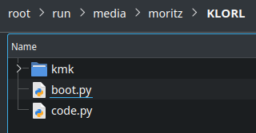

<p align="center">
  
</p>


This is a work in progress [KMK firmware](http://kmkfw.io/) for the [KLOR](https://github.com/GEIGEIGEIST/klor) keyboard.

Tested on the KLOR "SAEGEWERK" variant & RP2040 Pro Micro by SparkFun.

## Not yet implemented:

- LED support (because my KLOR does not use LEDs)
- OLED support
- Speaker support
- Haptic feedback
- Pixart Paw3204 trackball

other:
- Encoder is working on the left side

___
## Installation:
Follow the [KMK firmware TL;DR Quick start guide](http://kmkfw.io/docs/Getting_Started/#tldr-quick-start-guide) or the steps bellow:

*tl;dr: Install CircuitPython, rename microcontroller, install KMK + code.py*

### 1) Install CircuitPython:
1) [Download CircuitPython](https://circuitpython.org/downloads) for your microcontroller e.g. for the [RP2040 Pro Micro](https://circuitpython.org/board/sparkfun_pro_micro_rp2040/)
2) Enter the UF2 bootloader mode on your microcontroller.\
   Your RP2040 Pro Micro should appear as USB drive called "RPI-RP2"
3) Drag and drop the `*circuitpython*.uf2` file (downloaded in step 1) onto your "RPI-RP2" drive.
4) Reboot your microcontroller\
   It should now appear as a USB drive called "CIRCUITPY"

### 2) Rename your microcontroller
Next we rename our microcontroller / USB drives to "KLORL" (for the left keyboard side) and "KLORR" (for the right keyboard side) in order for KMK to figure out which side is which. 

- Follow this tutorial: ["Renaming CIRCUITPY through CircuitPython"](https://learn.adafruit.com/welcome-to-circuitpython/renaming-circuitpy#renaming-circuitpy-through-circuitpython-3014813)

**OR**

- take the `utilities/rename_klor_left/boot.py` file and drag it on your **left** microcontroller (currently named: "CIRCUITPY")
- take the `utilities/rename_klor_right/boot.py` file and drag it on your **right** microcontroller (currently named: "CIRCUITPY")

After a reboot the microcontroller should now appear as "KLORL" and "KLORR" respectively.

> :warning: **Single push reset button**: Reboot microcontroller - USB drive is called "CIRCUITPY" or e.g. "KLORL"

> :warning: **Double push reset button**: UF2 Bootloader mode - USB drive is called "RPI-RP2"

### Install KMK 
1) Get [a copy](https://github.com/KMKfw/kmk_firmware/archive/refs/heads/master.zip) of KMK from the master branch 
2) Unzip the file and copy the KMK folder and the boot.py file at the root of the USB drive (override the `boot.py` file used in step 2)
3) Download the `kb.py` & `main.py` files from this repository and also copy them onto your USB drive
4) Reboot

Repeat those steps for both the left and right microcontroller.

<p>
  
</p>

___
   
### Coord mapping for other KLOR variants
[This code](http://kmkfw.io/docs/porting_to_kmk/#find-your-coord-mapping) gave me the following coord_map on my "SAEGEWERK" KLOR. You can try it on your KLOR variant with the `utilities/coord_mapping/code.py` file.

```
LEFT side:            Right side:
001 002 003 004 005   029 028 027 026 025
007 008 009 010 011   035 034 033 032 031
013 014 015 016 017   041 040 039 038 037
019 020 021 023       047 045 044 043

```
I assume the missing coordinates for "Polydactyl", "KONRAD", "Yubitsume" are the following:

```
XXX = assumption
LEFT side:                RIGHT side:
X00 001 002 003 004 005   029 028 027 026 025 X24
X06 007 008 009 010 011   035 034 033 032 031 X30
X12 013 014 015 016 017   041 040 039 038 037 X36
X18 019 020 021 X22 023   047 X46 045 044 043 X42
```
Only when I based my keymap on the assumed coord_map I got the correct key positions working.\
I placed a `KC.NO` keycode as a placeholder on every XXX position.\
I guess with my current configuration KMK "thinks" that the KLOR has a simple 12 columns * 4 rows matrix.

