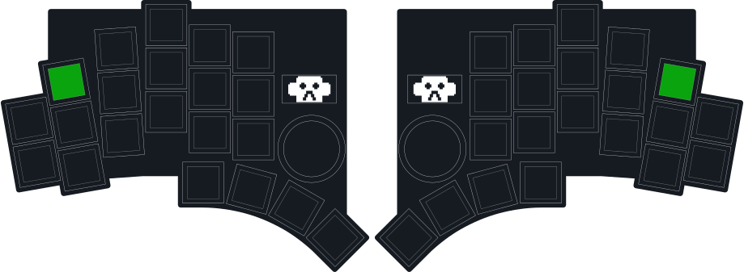

---
hide:
# Hide navigation bar on left side
  - navigation
---

## Hide device storage by default
Here is how to hide your microcontroller(s) from showing up as a USB storage by default:

- Copy the [`boot.py`](/utilities/hide_device_storage/boot.py) onto your `KLORL` / `KLORR` USB storage and replace the existing file.
- You can still access the device USB storage by holding a certain key on startup

!!! warning
    **After replacing the `boot.py` file you need to hold the green key on either left or right side when connecting the keyboard to your computer or rebooting it via reset button in order to see the USB storage.**



### Microcontroller support
`boot.py` is designed to work with the **SparkFun Pro Micro RP2040** but you can update this line in `boot.py` to [any supported microcontroller:](https://github.com/KMKfw/kmk_firmware/tree/master/kmk/quickpin/pro_micro)

```python
from kmk.quickpin.pro_micro.sparkfun_promicro_rp2040 import pinout as pins
```