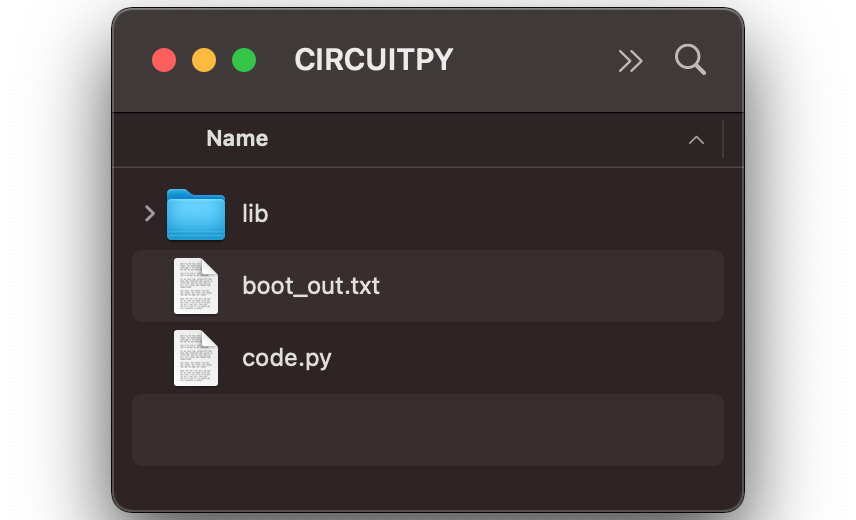
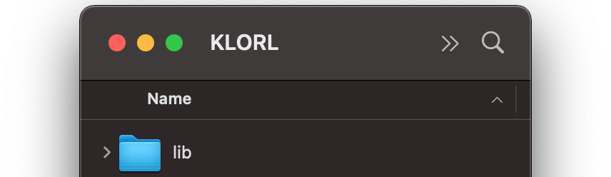

!!! info
    This firmware has been tested on **CircuitPython (stable) 7.3.3**

??? warning "Reset Button Help"
    **Single push reset button:**  
    *Reboot microcontroller* - USB drive is called "CIRCUITPY" or e.g. "KLORL"  
    **Double push reset button:**  
    *UF2 Bootloader mode* - USB drive is called e.g. "RPI-RP2"

## 1) Install CircuitPython

KMK is a keyboard focused layer that sits on top of CircuitPython.  
[**Follow these steps**](https://learn.adafruit.com/welcome-to-circuitpython/installing-circuitpython) and then come back here.

<!-- { width="500"} -->

## 2) Rename your microcontroller
Rename your microcontrollers / USB drives to "KLORL" (for the left keyboard side) and "KLORR" (for the right keyboard side) in order for KMK to figure out which side is which. 

Follow this tutorial: ["Renaming CIRCUITPY through CircuitPython"](https://learn.adafruit.com/welcome-to-circuitpython/renaming-circuitpy#renaming-circuitpy-through-circuitpython-3014813)  
**OR** use these preconfigured `boot.py` files:

=== "Rename LEFT side"
    take `utilities/rename_klor_left/boot.py` and drag it on your **left** microcontroller (currently named: "CIRCUITPY") 

=== "Rename RIGHT side"
    take `utilities/rename_klor_right/boot.py` and drag it on your **right** microcontroller (currently named: "CIRCUITPY")

After a reboot the microcontroller should appear as "KLORL" and "KLORR" respectively.

{ width="500"}

## 3) Install KMK 
1. Get [a copy](https://github.com/KMKfw/kmk_firmware/archive/refs/heads/master.zip) of KMK from the master branch 
2. Unzip and copy the `kmk` folder and the `boot.py` file at the root of the USB drive (override the `boot.py` file used in step 2)
3. Delete `code.py` from the USB drive

{ width="500"}

## 3) Install KLOR firmware
1. Download the `kb.py`, `main.py` & the `lib` folder from this repository and copy them onto your USB drive  
You can also find those files in `klor_kmk_firmware.zip` from [GitHub releases](https://github.com/moritz-john/kmk-config-klor/releases)
2. Reboot

Repeat those steps for both the left and right microcontroller.

{ width="500"}
