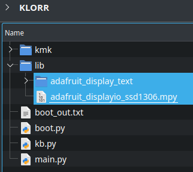

## OLED

### 1) Add the necessary libraries: 
In order to use OLEDs you have to:

1) Download the [adafruit-circuitpython-bundle-7.x-mpy-YYYYMMDD.zip](https://github.com/adafruit/Adafruit_CircuitPython_Bundle/releases/) file
2) Extract it
3) Copy the **folder** called `adafruit_display_text` and the **file** called `adafruit_displayio_ssd1306.mpy` out of your extracted `adafruit-circuitpython-bundle-7.x-mpy-YYYYMMDD/lib/` folder
4) Paste both file & folder into the `lib` folder on your microcontroller

<p>
  
</p>

### 2) Uncomment OLED code:
Afterwards you have to uncomment the OLED code in your `main.py` file:

```
# OLED code starts here ---
from kmk.extensions.peg_oled_Display import Oled,OledDisplayMode,OledReactionType,OledData
oled_ext = Oled(
    OledData(
        corner_one={0:OledReactionType.STATIC,1:["Layer"]},
        corner_two={0:OledReactionType.LAYER,1:["1","2","3",]},
        corner_three={0:OledReactionType.LAYER,1:["BASE","LOWER","RAISE",]},
        corner_four={0:OledReactionType.LAYER,1:["qwerty","nums","shifted",]}
        ),
        toDisplay=OledDisplayMode.TXT,
        flip=True,
)
keyboard.extensions.append(oled_ext)
# OLED code ends here ---
```

Consider moving the line: `from kmk.extensions.peg_oled_Display import Oled,OledDisplayMode,OledReactionType,OledData` 
to the top of your `main.py file` containing the rest of your `from [...] import [...]` code block.