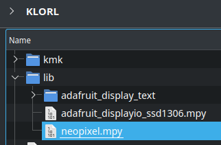

# RGB

>tl;dr: add library to your keyboard, set `klor_rgb = "basic_rgb" OR "peg_rgb"`, customize your RGB code and add rgb keycodes to your keymap to control your lighting.
## 1) Add the necessary library
In order to use RGB you have to install one library into your keyboard's `'lib'` folder:

You can find the necessary library included in the [`klor_kmk_firmware.zip` release](https://github.com/moritz-john/kmk-config-klor/releases).\
**or**\
You can download it yourself from here: [adafruit-circuitpython-bundle-7.x-mpy-YYYYMMDD.zip](https://github.com/adafruit/Adafruit_CircuitPython_Bundle/releases/)

1) Copy the **file** called `neopixel.mpy` out of your `adafruit-circuitpython-bundle-7.x-mpy-YYYYMMDD/lib/` folder
2) Paste the file into the `'lib'` folder on your microcontroller
3) Repeat for your other keyboard half

<p>
  
</p>

## 2) Chose your RGB mode
Afterwards you have to change the variable `klor_rgb` from `"none"` to either `"basic_rgb"` **or** `"peg_rgb"` in your [`main.py`](../main.py) file and also set `klor_variant` to your own [KLOR variant](https://github.com/GEIGEIGEIST/klor#layouts):

```python
klor_variant = "saegewerk" #<- Change this to your own KLOR variant: "polydactyl", "konrad", "yubitsume", "saegewerk"
klor_rgb = "none"  #<- Change this to "basic_rgb" OR "peg_rgb"
klor_oled = False
klor_speaker = False
```
## 3) Basic RGB vs PEG RGB
If you need to address LEDs individually (so change specific LEDs to a different color) use [`peg_rgb`](http://kmkfw.io/docs/peg_rgb_matrix/) in any other case use the more powerful [`basic_rgb`](http://kmkfw.io/docs/rgb/) implementation.\
*I would recommend going with `basic_rgb`.*

## 4) Customize your RGB expierience
### 4.1 Basic RGB
*You can find the code in your [`kb.py`](../kb.py#L149) file.*

```python
        rgb = RGB(
            pixel_pin=self.rgb_pixel_pin,
            num_pixels=pixels,
            val_limit=50,
            hue_default=0,
            sat_default=100,
            val_default=20,
        )
```

Consider changing `hue_default`, `sat_default` or `val_default`. Use a value in the range `0-255`.\
Read more about this here: http://kmkfw.io/docs/rgb/#configuration

You can also change the colors and much more at runtime via [RGB keycodes](http://kmkfw.io/docs/rgb/#keycodes).

### 4.2 PEG RGB
*You can find the code in your [`kb.py`](../kb.py#L24) file.*

```python
rgb_data = [
                 [0, 191, 255], [0, 255, 128], [63, 255, 0], [254, 255, 0], [251, 64, 0],                                                              [251, 64, 0], [254, 255, 0], [63, 255, 0], [0, 255, 128], [0, 191, 255],
    [0, 0, 255], [0, 191, 255], [0, 255, 128], [63, 255, 0], [254, 255, 0], [251, 64, 0],                                                              [251, 64, 0], [254, 255, 0], [63, 255, 0], [0, 255, 128], [0, 191, 255], [0, 0, 255],
    [0, 0, 255], [0, 191, 255], [0, 255, 128], [63, 255, 0], [254, 255, 0], [251, 64, 0],                                                              [251, 64, 0], [254, 255, 0], [63, 255, 0], [0, 255, 128], [0, 191, 255], [0, 0, 255],
                                                             [254, 255, 0], [251, 64, 0], [247, 0, 122], [188, 0, 249],   [188, 0, 249], [247, 0, 122],[251, 64, 0], [254, 255, 0],
]
```
Each `[R, G, B]` list matches a KLOR key as seen in [`led_positions`](../kb.py#L12). Keep in mind that some KLOR variants have less keys.\
Adjust `[R, G, B]` with a value between `[0-255, 0-255, 0-255]`.


Instead of using **RGB codes**, such as `[255,55,55]`, one can use **Color classes** like `Color.RED` or `Color.GREEN`.\
Uncomment `# from kmk.extensions.peg_rgb_matrix import Color` in [`kb.py`](../kb.py#L8) to activate this feature.\
[HERE](https://github.com/KMKfw/kmk_firmware/blob/master/kmk/extensions/peg_rgb_matrix.py#L10) is a list of predefined color names.

It is possible to mix and match RGB codes with Color classes e.g.:
```python
rgb_data = [
    Color.BLUE, [0, 255, 128], Color.RED, [...]
]
```

You **can't** adjust colors at runtime with `peg_rgb` via keycodes.

 ## 5) Add RGB keycodes to your keymap
 Add some keycodes to your keymap in order to control your RGB lighting e.g.: turn it on or off via `KC.RGB_TOG`

 For `basic_rgb` use [these keycodes](http://kmkfw.io/docs/rgb#keycodes).

 For `peg_rgb` use [these keycodes](http://kmkfw.io/docs/peg_rgb_matrix/#keycodes) (yes, there are only three).